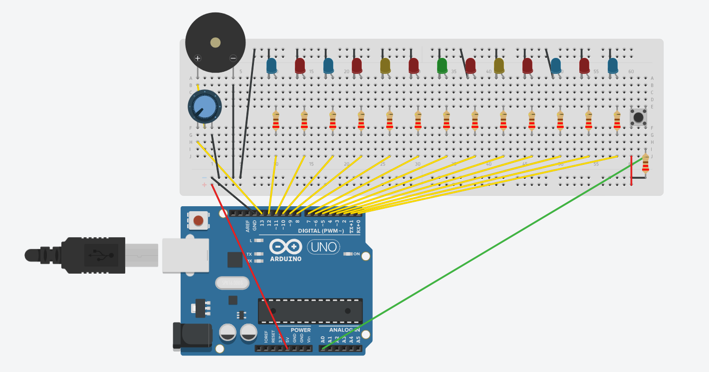

# arduino-roulette
> A roulette-type game using LEDs and an Arduino Uno R3

## Parts list
- 1x **Arduino Uno R3**
- 6x **Red LEDs**
- 4x **Blue LEDs**
- 2x **Yellow LED**
- 1x **Green LED**
- 14x **220Ω Resistors**
- 1x **Pushbutton**
- 1x **Piezo buzzer**
- 1x **Potentiometer**

## Diagrams

Diagrams generated through [Tinkercad](https://www.tinkercad.com/)
